# АНАЛИЗ ДАННЫХ И ИСКУССТВЕННЫЙ ИНТЕЛЛЕКТ [AD in GameDev]
Отчет по *Лабораторной работе №4* выполнил:
- Крюков Никита Андреевич
- РИ-230915 (AT-01)

| Задание | Выполнение | Баллы |
| ------ | ------ | ------ |
| Задание 1 | * | ? |
| Задание 2 | * | ? |
| Задание 3 | * | ? | 

Работу проверили:
- к.т.н., доцент Денисов Д.В.
- к.э.н., доцент Панов М.А.
- ст. преп., Фадеев В.О.


# Цель работы
Создать и настроить перцептроны, которые будут работать, как логические функции OR, AND, NAND, XOR.

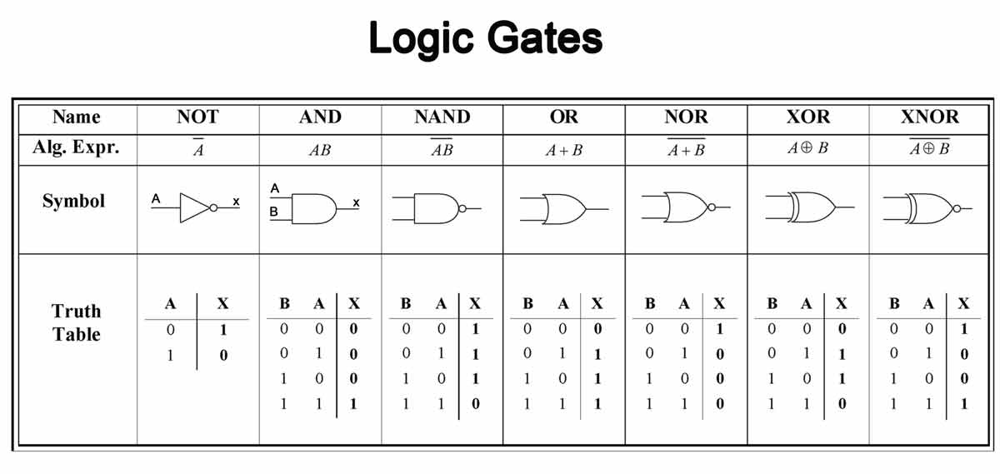


## Задание 1
*Реализовать перцептроны, которые умеют производить вычисления: OR, AND, NAND, XOR.*

Ход работы:
- Подготовить шаблон уровня, чтобы можно было удобно визуализировать модель работы.
- Написать скрипт PerceptronController.cs, который будет контролировать сцену используя парцептрон.
- Модифицировать скрипт Perceptron.cs, который будет управлять парцептроны.
- Создать парцептрон OR и обучить его.
- Создать парцептрон AND и обучить его.
- Создать парцентрон NAND и обучить его.
- Реализовать парцептрон XOR и обучить его.


### Создание шаблона сцены
Создал простой шаблон сцены, на которую добавил два кубика, они будут визуализировать в дальнейшем модель работы. Скачал скрипт преподавателя, и создал парцептрон, как сказано в методичке.

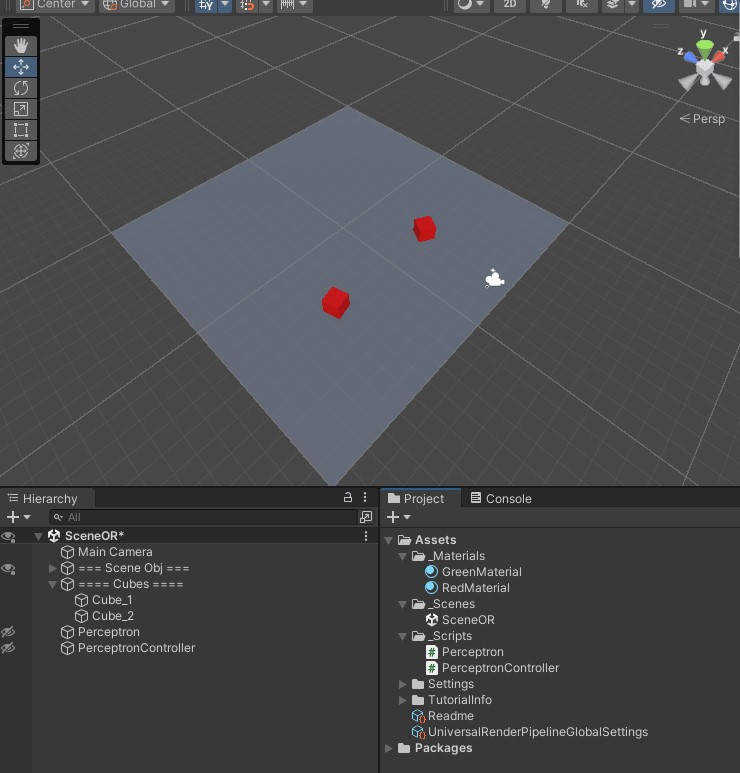


### Написать скрипт PerceptronController.cs
Создал на сцене пустой объект, накинул на него созданный скрипт. **В скрипте контроллера указываются входные данные** и необходимые для контроля обекты (кубы, парцептрон). В основном этот скрипт будет брать выходные данные с парцептрона и в дальнейшем контролировать визуализацию модели.

При старте игры, он присваивает кубикам цвета, которые соответствуют значению данных, которые ввёл пользователь (нуля и единицы): для нуля - красный цвет, для единицы - зеленый цвет. Далее контроллер двигает кубики на встречу друг другу, пока они не сталкнутся, чтобы визуально было видно влияние логического оператора. Чтобы заранее обозначать превосходство и влияние одного из кубиков на другой в инспекторе добавлен enum с логическими операторами **(этот enum не влияет на логику парцептрона)**.

Скрипт PerceptronController.cs.

Как выглядит в инспекторе:

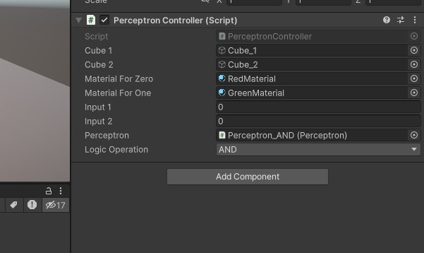


### Модификация Perceptron.cs
Для того, чтобы контроллер мог получать результат парцептрона, метод CalcOutput был сделан публичным, чтобы обращаться к нему. Дополнительно изменил стиль кода, для своего удобства. Добавел переменную для эпох. Также добавил событие, после тренировки парцептрона, чтобы PerceptronController.cs мог среагировать на событие и начать работу. После тренировки скрипт говорит другим: "Моё обучение закончилось, можете обращаться ко мне".

```cpp

using System.Collections;
using System.Collections.Generic;
using UnityEngine;


[System.Serializable]
public class TrainingSet
{
    public double[] input;
    public double output;
}


public class Perceptron : MonoBehaviour
{
    public int epochCount;

    public TrainingSet[] trainingSet;
    double[] weights = { 0, 0 };
    double bias = 0;
    double totalError = 0;

    // Событие по окончанию обучения.
    public delegate void TrainingCompletedEventHandler ();
    public event TrainingCompletedEventHandler OnTrainingCompleted;


    private double DotProductBias (double[] v1, double[] v2)
    {
        if (v1 == null || v2 == null)
            return -1;

        if (v1.Length != v2.Length)
            return -1;

        double d = 0;
        for (int x = 0; x < v1.Length; x++) {
            d += v1[x] * v2[x];
        }

        d += bias;

        return d;
    }

    private double CalcOutput (int i)
    {
        double dp = DotProductBias(weights, trainingSet[i].input);
        if (dp > 0) return (1);
        return (0);
    }

    private void InitialiseWeights ()
    {
        for (int i = 0; i < weights.Length; i++) {
            weights[i] = Random.Range(-1.0f, 1.0f);
        }
        bias = Random.Range(-1.0f, 1.0f);
    }

    private void UpdateWeights (int j)
    {
        double error = trainingSet[j].output - CalcOutput(j);
        totalError += Mathf.Abs((float)error);
        for (int i = 0; i < weights.Length; i++) {
            weights[i] = weights[i] + error * trainingSet[j].input[i];
        }
        bias += error;
    }

    public double CalcOutput (double i1, double i2)
    {
        double[] inp = new double[] { i1, i2 };
        double dp = DotProductBias(weights, inp);
        if (dp > 0) return (1);
        return (0);
    }

    private void Train (int epochs)
    {
        InitialiseWeights();

        for (int e = 0; e < epochs; e++) {
            totalError = 0;
            for (int t = 0; t < trainingSet.Length; t++) {
                UpdateWeights(t);
                Debug.Log("W1: " + (weights[0]) + " W2: " + (weights[1]) + " B: " + bias);
            }
            Debug.Log("TOTAL ERROR: " + totalError);
        }

        Debug.Log("Обучение завершено");

        // Вызов события по окончанию обучения.
        if (OnTrainingCompleted != null) {
            OnTrainingCompleted.Invoke();
        }
    }

    private void Start ()
    {
        Debug.Log("Старт обучения...");
        Train(epochCount);

        Debug.Log("Тестировани...");

        Debug.Log("Test 1, values 0 0 --> " + CalcOutput(0, 0));
        Debug.Log("Test 2, values 0 1 --> " + CalcOutput(0, 1));
        Debug.Log("Test 3, values 1 0 --> " + CalcOutput(1, 0));
        Debug.Log("Test 4, values 1 1 --> " + CalcOutput(1, 1));

        Debug.Log("Тестировани завершено");
    }
}

```


### Реализация OR
Созданный перцептрон настраиваем, по методичке, которою предоставил преподаватель. Логика понятна.

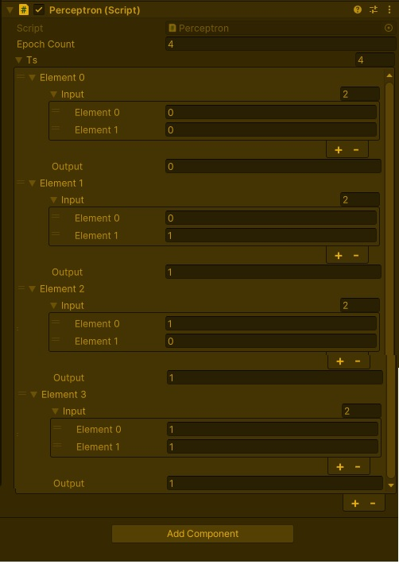

После заполнения данных указываем количество эпох и запускаем сцену. 

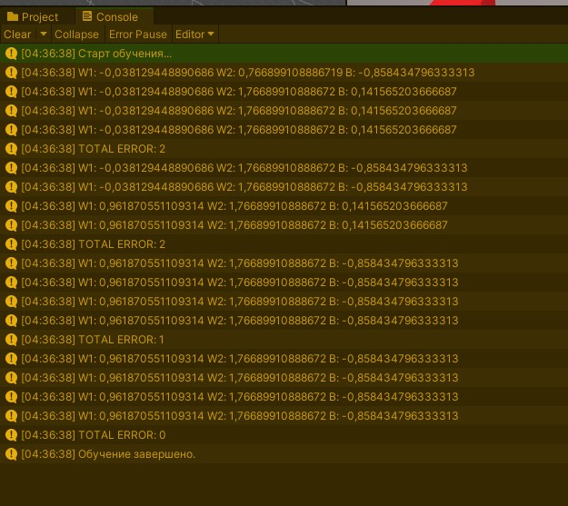

Сколько нужно эпох? **Методом тыка 10 раз на старт сцены подряд определил, что для оператора OR (И) вполне достаточно 5 эпох.**

Всё работает отлично. Контроллер ждет события от перцептона. Когда событие пришло начинает двигать кубики, которые демонстрируют работу модели **(о том как это выглядит в разделе задания 2)**.


### Реализация AND, NAND
Реализуются аналогично, как предыдущее. **Для каждой модели создал отдельную сцену**.
Единственное отличие, это в количестве эпох. Как выявило тестирование для обучения таких моделей нужно 10 эпох.


### Реализация XOR
Для реализации этой модели даже 50 эпох было не достаточно. XOR - это такой оператор, который является комбинацией операторов AND и OR. На этапе реализации такой модели нам придется создать микронейронную сеть т.е использовать комбинацию двух перцептронов.
Для такой реализации дополнительно создаю пустой объект и вешаю на него скрипт XORCombiner.cs, который, как раз будет посредником между контроллером и перцептронами. XORCombiner возвращает значение с помощью тернарного оператора.

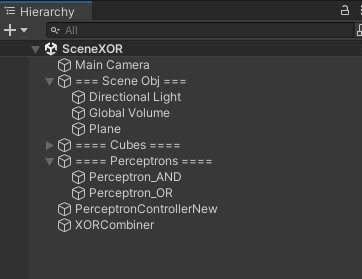

Из прошлый сцен копирую перцептроны AND и OR, ссылаюсь на них в объекте XORCombiner.
Дополнительно пришлось модифицировать скрипт контроллера, который я сохранил как PerceptronControllerNew.cs. Как ранее говорил, XOR - комбинация AND и OR.


# Задание 2
Буду строить графики используя в качестве постоянной 15 эпох, для всех моделей, чтобы можно было визуально пронаблюдать.

OR: 

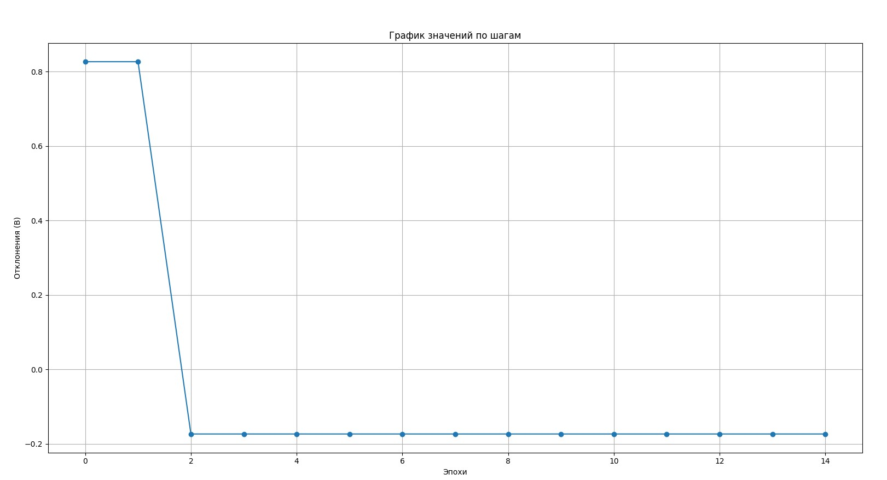

AND:

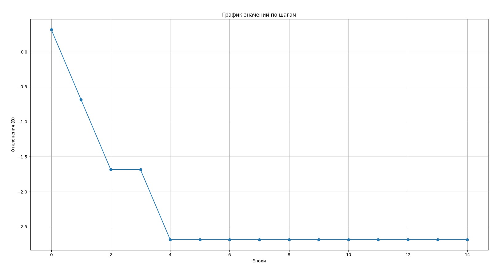

NAND:

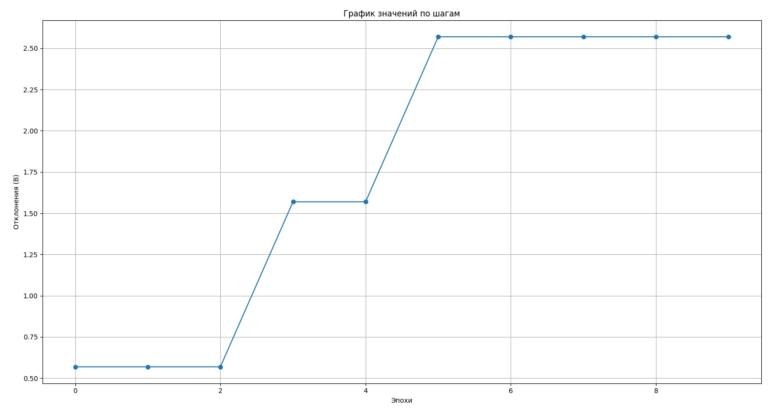

XOR:


# Задание 3
Некоторые моменты визуализации описал выше. Вот как всё примерно выглядит:
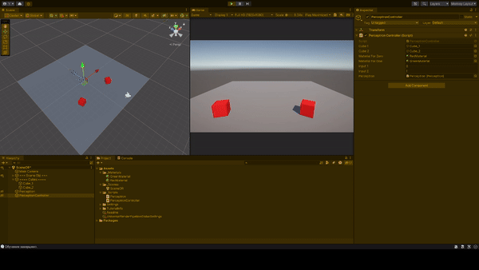

Можете скачать репозиторий и попробовать, каждая модель работает.


## Выводы
Была проделана колоссальная работа. В ходе работы были реализована модели перцептрона, которые повторяют логические операторы OR, AND, NAND, XOR. Самым сложным в реализации оказалась модель XOR т.к практика показала, что недостаточно одного перцептрона, чтобы реализовать. 


Буду ждать комментариев по поводу моего отчёта, хорошего Вам дня !

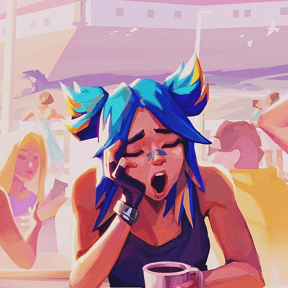
